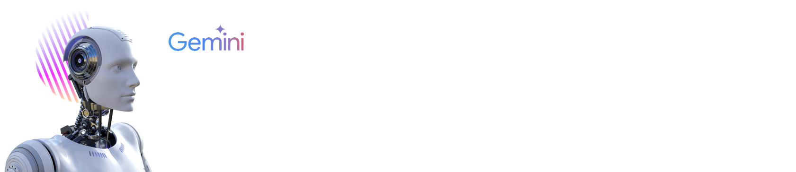
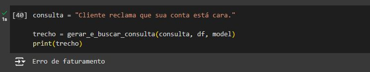

# Projeto para Imersão Inteligência Artificial 2ª Edição

## Triagem de Reclamações com Google Gemini

Este projeto tem como objetivo auxiliar atendentes que recebem reclamações a partir de um SAC (Serviço de Atendimento ao Consumidor) em uma empresa de distribuição de Energia Elétrica, a ingressagem as reclamações utilizando as tipologias corretas para cada cenário.

A escolha do tema foi devido a complexidade que esta classificação alcança na medida que a quantidade de tipologias aumenta. Em um cenário de atendimento real, podem ocorrer erros de cadastro caso o atendente não identifique corretamente a tipologia. Estes erros comprometem a assertividade das equipes que irão tratar estas reclamações, gerando muitas vezes um atraso desnecessário para a solução da demanda do consumnidor.

## Tecnologias utilizadas no projeto

- Linguagem de Programação Python
- Bibliotecas numpy e pandas do Python
- Google API Key
- Google AI Studio
- Google Colab
- Github

## Recursos

O sistema pode receber entrada de dados em dois cenários:

1. O próprio atendente que está realizando o atendimento pode digitar a demanda do cliente e como retorno terá a tipologia adequada.

2. Para o caso da reclamação ser recebida via texto, exemplo, e-mail, formulário web, aplicativos de mensagem, etc. Pode ser copiada toda a mensagem do cliente e receber a tipologia adequada para ingresso da manifestação.

## Observação

Para fim de testes, foram utilizados 3 tipologias que serão posteriormente ampliadas para o cenário real.

## Resultados

Os resultados obtidos utilizando a API Key do Google e os conhecimentos obtidos na Imersão IA da Alura são Incríveis!

Segue uma breve descrição dos testes realizados.

Foram realizados os testes utilizando como Exemplo, 3 possíveis tipologias de reclamações: Falta de Energia, Serviço Atrasado, Erro de faturamento. Segue a descrição de cada tipo de reclamação:

| Tipologia           | Quando utilizar                                                                                                  |
| ------------------- | ---------------------------------------------------------------------------------------------------------------- |
| Falta de Energia    | Utilizada quando o cliente reporta a interrupção no fornecimento de energia elétrica em sua unidade consumidora. |
| Serviço Atrasado    | Utilizada quando o cliente solicita um serviço à distribuidora e este não é realizado dentro do prazo previsto.  |
| Erro de faturamento | Utilizada quando o cliente identifica irregularidades em sua fatura de energia elétrica.                         |

### Primeiras consultas

 Inicialmente foram realizadas 3 consultas, baseando em um cenário em que o próprio atendente do SAC digitaria o teor da reclamação que está recebendo e receberia em qual tipologia a reclamação deveria ser classificada:

> Consulta 1 - **Cliente reclama que solicitou ligação e não foi atendido** - Resposta recebida: **Serviço Atrasado**

> Consulta 2 - **Cliente reclama que sua conta está cara**. - Resposta recebida: **Erro de faturamento**

> Consulta 3 - **Cliente reclama que solicitou ligação e não foi atendido** - Resposta recebida: **Falta de Energia**

Depois foi realizado mais um teste, agora incluindo um texto mais complexo que seria recebido do próprio cliente e encaminhado para que a API do Gemini identifica-se a classificação correta desta reclamação:

> Consulta 4 - **Quero reclamar que minha conta de luz está muito cara. Quase não paro em casa e cada mês que passa pago mais de luz.** - Resposta recebida: **Erro de faturamento**

##  License

[MIT License](./LICENSE)